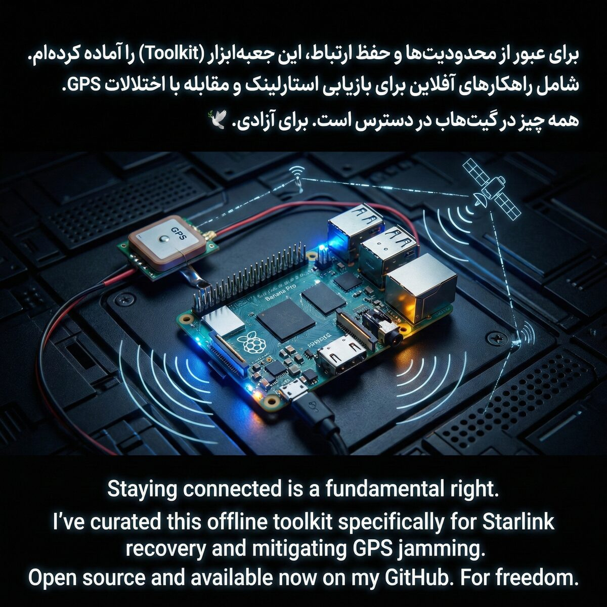

# Starlink Offline GPS Anti‑Jamming Kit (Iran)

[English](#english) | [فارسی](#فارسی)

## English

This repository is a **fully offline** kit to help Starlink users recover service when **GPS/GNSS jamming** prevents a terminal from getting a reliable fix.

It includes:
- Click‑to‑run launchers for **Windows / macOS / Linux**
- Bundled `grpcurl` binaries (no internet needed after you have the folder)
- A safe **Probe** mode to check whether your firmware exposes the required request field
- Offline gRPC schema included (works even if reflection is disabled)
- Bilingual documentation (English + فارسی)

### Download (GitHub Releases)
Get this kit from the official Releases page:

`https://github.com/freedom-fighter-1404/starlink-gps-jamming-recovery-offline-kit/releases`

Choose **ONE** ZIP:
- **Windows:** `starlink-gps-jamming-recovery-offline-kit_v1.0.3_windows.zip`
- **macOS (Intel + Apple Silicon):** `starlink-gps-jamming-recovery-offline-kit_v1.0.3_macos.zip`
- **Linux (x86_64 + arm64):** `starlink-gps-jamming-recovery-offline-kit_v1.0.3_linux.zip`
- **All platforms (bigger):** `starlink-gps-jamming-recovery-offline-kit_v1.0.3_all-platforms.zip`

For verification, also download the matching:
- `…zip.sha256` (required)
- `…zip.sshsig` (optional, if present)

### Security & verification (read this first)
#### IRAN / HIGH‑RISK WARNING (IRGC / Sepah) — VERIFY SHA‑256
**Assume a modified copy with injected malware may be redistributed. Verify the Release ZIP SHA‑256 before you extract or run anything.**

If you downloaded this from GitHub Releases:
1) Download the ZIP for your OS **and** the matching `.sha256` file (and the optional `.sshsig`).
2) Verify the ZIP’s SHA‑256 matches the `.sha256` value (see `docs/VERIFY.md`).
3) Extract the ZIP, then run the built‑in integrity check:
   - Windows: `verify_integrity.bat`
   - macOS/Linux: `./verify_integrity.sh`

This project provides **SHA‑256** checksums and may also provide **OpenSSH signatures** (`.sshsig`) for release ZIPs. It does **not** provide PGP/GPG signatures at this time.

### Important (read first)
- Use only on equipment you own/control, and follow local laws and Starlink terms.
- This kit addresses **GPS/GNSS jamming only**. If the Ku/Ka user link is jammed, performance may still be degraded.
- This kit only talks to the dish on your **local network** (`192.168.100.1`). It does not contact external servers.
- Hardware testing is required for full confirmation; this kit is based on public references and is designed to fail safely.

### Quick start (no internet required)
1) Connect your device to **Starlink Wi‑Fi** (same local network as the dish).
2) Run ONE launcher:
   - Windows: double‑click `START_WINDOWS.bat`
   - macOS: double‑click `START_MAC.command`
   - Linux: run `./START_LINUX.sh`
3) Choose **Disable GPS**.
   - If it becomes enabled again after reboot/updates, use **Daemon disable** (re-sends every 5 minutes).
   - Use **Status** to print current output.
   - If Disable GPS fails, run **Probe** and read `docs/OLDER_FIRMWARE.md`.

### What it does (based on public references)
When supported by your Starlink firmware, it sends this local gRPC request:

`{"dishInhibitGps":{"inhibitGps":true}}`

to:

`192.168.100.1:9200 SpaceX.API.Device.Device/Handle`

### Verify integrity (recommended in high-risk environments)
- Windows: run `verify_integrity.bat` (or `verify_integrity.ps1`)
- macOS/Linux: run `./verify_integrity.sh`
- Verification guide (releases + hashes): `docs/VERIFY.md`
- More: `docs/SECURITY.md` and `docs/AUDIT.md`

---

## فارسی

این مخزن یک کیت **کاملاً آفلاین** است برای زمانی که **پارازیت GPS/GNSS** باعث می‌شود دیش استارلینک نتواند موقعیت/زمان را درست تشخیص دهد و اتصال دچار مشکل شود.

این کیت شامل موارد زیر است:

- فایل‌های اجرایی “کلیک و اجرا” برای **Windows / macOS / Linux**
- باینری آماده‌ی `grpcurl` (بعد از داشتن پوشه، اینترنت لازم نیست)
- حالت **Probe** برای بررسی اینکه فریمور شما فیلد مورد نیاز را دارد یا نه
- Schema آفلاین داخل کیت (حتی اگر Reflection غیرفعال باشد هم کار می‌کند)
- مستندات دو زبانه (English + فارسی)

### امنیت و صحت‌سنجی (حتماً قبل از اجرا)
قاعده ساده: **قبل از اجرا، صحت‌سنجی کنید**.

#### هشدار بسیار مهم برای ایران (IRGC / سپاه) — بررسی SHA‑256
**فرض کنید نسخه‌های دستکاری‌شده با تزریق کد مخرب ممکن است بازنشر شوند. قبل از Extract یا اجرا، حتماً هش SHA‑256 فایل ZIP انتشار را بررسی کنید.**

### دانلود (GitHub Releases)
این کیت را از صفحه رسمی انتشارها (Releases) دریافت کنید:

`https://github.com/freedom-fighter-1404/starlink-gps-jamming-recovery-offline-kit/releases`

فقط **یکی** از فایل‌ها را دانلود کنید:
- **Windows:** `starlink-gps-jamming-recovery-offline-kit_v1.0.3_windows.zip`
- **macOS (Intel + Apple Silicon):** `starlink-gps-jamming-recovery-offline-kit_v1.0.3_macos.zip`
- **Linux (x86_64 + arm64):** `starlink-gps-jamming-recovery-offline-kit_v1.0.3_linux.zip`
- **همه سیستم‌ها (حجم بیشتر):** `starlink-gps-jamming-recovery-offline-kit_v1.0.3_all-platforms.zip`

برای صحت‌سنجی، فایل‌های کنار آن را هم دانلود کنید:
- `…zip.sha256` (الزامی)
- `…zip.sshsig` (اختیاری، اگر وجود داشت)

اگر این کیت را از بخش Releases دریافت کرده‌اید:
1) فایل ZIP مخصوص سیستم‌عامل خود **و** فایل `.sha256` مربوط به همان ZIP (و در صورت وجود، فایل `.sshsig`) را دانلود کنید.
2) هش SHA‑256 فایل ZIP را با مقدار داخل فایل `.sha256` مقایسه کنید (راهنما: `docs/VERIFY_FA.md`).
3) ZIP را Extract کنید و سپس صحت‌سنجی داخلی را اجرا کنید:
   - Windows: `verify_integrity.bat`
   - macOS/Linux: `./verify_integrity.sh`

این پروژه برای صحت‌سنجی از **SHA‑256** استفاده می‌کند و ممکن است برای فایل ZIP انتشار، امضای **OpenSSH** (`.sshsig`) هم ارائه کند. در حال حاضر امضای PGP/GPG ارائه نمی‌کند.

### نکات مهم (حتماً بخوانید)
- فقط روی تجهیزاتی که مالک/مسئول آن هستید استفاده کنید و قوانین محلی و شرایط سرویس استارلینک را رعایت کنید.
- این کیت فقط مشکل **پارازیت GPS/GNSS** را هدف می‌گیرد. اگر لینک Ku/Ka هم پارازیت شود، ممکن است باز هم افت کیفیت داشته باشید.
- این کیت فقط با دیش روی **شبکه محلی** شما صحبت می‌کند (`192.168.100.1`) و به هیچ سرور خارجی وصل نمی‌شود.
- برای تأیید کامل، تست سخت‌افزار لازم است؛ این کیت بر اساس منابع عمومی تهیه شده و طوری طراحی شده که در صورت ناسازگاری، ایمن و شفاف خطا بدهد.

### شروع سریع (بدون نیاز به اینترنت)
1) به **Wi‑Fi استارلینک** وصل شوید (همان شبکه محلی دیش).
2) فقط یکی را اجرا کنید:
   - Windows: روی `START_WINDOWS.bat` دوبار کلیک کنید
   - macOS: روی `START_MAC.command` دوبار کلیک کنید
   - Linux: دستور `./START_LINUX.sh` را اجرا کنید
3) گزینه **Disable GPS** را انتخاب کنید.
   - اگر بعد از ریبوت/آپدیت برمی‌گردد، از **Daemon disable** استفاده کنید (هر ۵ دقیقه دوباره ارسال می‌کند).
   - برای دیدن خروجی وضعیت از **Status** استفاده کنید.
   - اگر خطا داد، **Probe** را اجرا کنید و `docs/OLDER_FIRMWARE_FA.md` را بخوانید.

### این کیت چه کاری می‌کند؟ (بر اساس منابع عمومی)
در صورت پشتیبانی فریمور، این درخواست gRPC را به صورت محلی ارسال می‌کند:

`{"dishInhibitGps":{"inhibitGps":true}}`

به آدرس:

`192.168.100.1:9200 SpaceX.API.Device.Device/Handle`

### صحت‌سنجی (در محیط‌های پرریسک توصیه می‌شود)
- Windows: `verify_integrity.bat` (یا `verify_integrity.ps1`) را اجرا کنید
- macOS/Linux: `./verify_integrity.sh` را اجرا کنید
- راهنمای صحت‌سنجی (Release و هش‌ها): `docs/VERIFY_FA.md`
- اطلاعات بیشتر: `docs/SECURITY_FA.md` و `docs/AUDIT.md` و `docs/AUDIT_FA.md`

